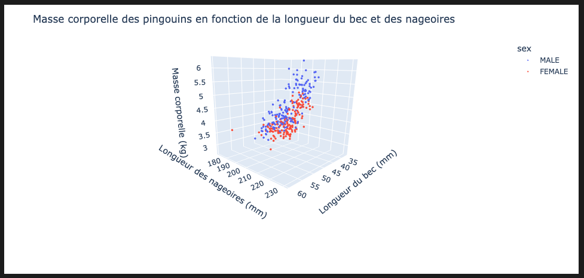

# TP3 - Analyse de données sur les pingouins avec des librairies scientifiques


## Directives
:alarm_clock: Date de remise : Le 16 mars 2025

:mailbox_with_mail: À remettre sur Github (nous allons corriger votre dernier `git push` effectué avant la date limite)

## Introduction
Vous êtes chercheur(e) dans un laboratoire de recherche en Antarctique et vous étudiez les populations de pingouins :penguin:. Lors d'une expédition, vous avez recueilli une base de données contenant des informations sur les pingouins, qui sont enregistrées dans le fichier `penguins.csv`. Ces données incluent :

- L'espèce du pingouin
- L'île d'habitation
- La longueur et la largeur du bec ("culmen"), en mm
- La longueur des nageoires ("flipper"), en mm
- La masse corporelle, en g
- Le sexe (mâle ou femelle)

Votre objectif est de visualiser cette base de données à l'aide de représentations graphiques pour identifier des tendances et des différences de taille et de masse entre les espèces, ainsi qu'entre les mâles et les femelles. Pour ce faire, vous serez amenés à utiliser les librairies Python suivantes, qui sont fréquemment utilisées pour l'analyse et la visualisation de données : 

- [Pandas](https://pandas.pydata.org/docs/getting_started/index.html) : est une librairie principalement utilisée pour la manipulation et l'analyse de données. Elle est spécialement conçue pour travailler avec des structures de données étiquetées que l'on appelle DataFrames, ce qui la rend idéale pour traiter des données structurées comme celles contenues dans le fichier `penguins.csv`
  
- [Matplotlib](https://matplotlib.org/stable/) : est une librairie de base pour la création de graphiques en Python. Elle offre une grande flexibilité pour personnaliser l’apparence des figures, les axes, les légendes, les couleurs, etc.

- [Seaborn](https://seaborn.pydata.org/index.html) : est une extension de Matplotlib qui simplifie la création de visualisations statistiques élégantes et informatives. Cette librairie s'intègre facilement à la structure des DataFrames de Pandas, ce qui la rend populaire pour les bases de données comme celle que nous avons pour les pingouins.  

- [Plotly](https://plotly.com/python/) : est une librairie qui permet de générer facilement des figures visuelles et de les rendre interactives, ce qui est très pratique pour l'exploration et la présentation de données. Elle offre également de nombreuses fonctionnalités pour personnaliser les graphiques et les intégrer dans des applications web ou des notebooks interactifs.

Pour ce TP, au lieu de travailler dans des fichiers Python (`.py`), nous allons travailler avec un Jupyter Notebook (`.ipynb`). 

## Qu'est-ce qu'un Jupyter Notebook ?
Un [Jupyter Notebook](https://jupyter.org) est un environnement interactif utilisé pour écrire et exécuter du code, ainsi que pour visualiser des résultats en temps réel. Il permet d'intégrer à la fois du code, des commentaires textuels (en langage Markdown), des visualisations et des équations mathématiques, ce qui en fait un outil très intéressant pour documenter, par exemple, un projet d'analyse de données. 

### Structure d'un Jupyter Notebook :
Un notebook se compose de cellules qui peuvent être :

- Cellules de code : Où vous écrivez et exécutez du code Python.
- Cellules Markdown : Où vous ajoutez des explications, des descriptions ou des notes en utilisant le langage Markdown, qui permet de formater du texte.

### Comment ça fonctionne :
Lorsqu'un Jupyter Notebook est ouvert, vous pouvez exécuter chaque cellule individuellement, ce qui permet une exécution étape par étape. Les résultats (comme les graphiques ou les variables calculées) sont affichés directement sous la cellule de code (au lieu d'un terminal). 

Il est également possible d'exécuter toutes les cellules l'une à la suite de l'autre avec le bouton "Run All" dans VS Code. 

## Installations requises
Avant de débuter ce TP, vous devez installer jupyter ainsi que l'extension de Jupyter Notebook dans VS Code. 

1. Pour installer jupyter, ouvrez un nouveau terminal dans VS Code et entrez la commande suivante : 

```bash
    pip install jupyter
```

2. Ensuite, installez l'extension Jupyter dans VS Code :

- Allez à l'icône des extensions dans la barre latérale de gauche.
- Recherchez Jupyter.
- Installez l'extension Jupyter développée par Microsoft.

Une fois jupyter et l'extension Jupyter Notebook installés, vous pouvez maintenant ouvrir le Jupyter Notebook intitulé `TP3.ipynb` et suivre les instructions pour réaliser le TP. 

Vous allez également devoir installer les 4 librairies mentionnées ci-haut, soit Pandas, Matplotlib, Seaborn et Plotly. Les instructions d'installation se retrouvent dans le Jupyter Notebook `TP3.ipynb`. 

## Instructions pour le TP
Les étapes détaillées et les instructions pour réaliser ce TP sont disponibles dans le Jupyter Notebook intitulé "TP3.ipynb".
La section suivante fournit des exemples de résultats attendus pour chaque exercice, afin de vous aider à visualiser à quoi devraient ressembler vos réponses.

### Résultats attendus pour les exercices du TP

#### Partie 1 : Chargement du DataFrame avec Pandas
Pour la partie 1, votre DataFrame initial devrait ressembler à ceci : 


Attention : l'affichage ne devrait PAS ressembler à ceci : 


Les statistiques du DataFrame devraient ressembler à ceci :


#### Partie 2 : Affichage de graphiques avec Matplotlib et Seaborn
Voici un exemple de bonne solution pour le graphique avec les boxplots : 


Voici un exemple de bonne solution pour le graphique avec les nuages de points en "subplots" : 


#### Partie 3 : Affichage d'un nuage de points 3D interactif avec Plotly
Voici un exemple de bonne solution pour le graphique de nuage de points 3D interactif :



#### Partie bonus : Affichage d'une image d'un pingouin
Voici le résultat attendu pour la question bonus : 


## Barème de correction

Le barème de correction pour ce TP est le suivant : 

| **Partie**                                | **Tâche**                                                                 | **Points** |
|--------------------------------------------------------|--------------------------------------------------------------------------------------------------------------|------------|
| **Partie 1 : Chargement d'une base de données avec pandas** |                                                                                            | **/7**     |
|                                                        | 1.1 Compléter la fonction `charger_donnees`                                                                  | 1          |
|                                                        | 1.2 Utiliser `charger_donnees` pour obtenir le dataframe                                                     | 0.5        |
|                                                        | 1.3 Affichage du dataframe                                                                                   | 0.5        |
|                                                        | 1.4 Compléter la fonction `supprimer_colonnes_donnees_manquantes`                                            | 1          |
|                                                        | 1.5 Utiliser `supprimer_colonnes_donnees_manquantes` pour supprimer les rangées avec données NaN             | 0.5        |
|                                                        | 1.6 Affichage du dataframe modifié                                                                           | 0.5        |
|                                                        | 1.7 Compléter la fonction `conversion_colonnes`                                                              | 1.0        |
|                                                        | 1.8 Utiliser `conversion_colonnes` pour modifier la colonne body_mass_g                                      | 0.5        |
|                                                        | 1.9 Affichage du dataframe modifié                                                                           | 0.5        |
|                                                        | 1.10 Affichage des statistiques du dataframe                                                                           | 1        |
| **Partie 2 : Affichage de graphiques avec les librairies Matplotlib et Seaborn** |                                                                       | **/9**    |
| 2.1 Figure avec graphique de type boxplot (4 points)                                                                                                                  | 
|                                                        | Utilisation du bon type de graphique avec la bonne librairie                                                 | 1          |
|                                                        | Attribution des données sur les axes x et y                                                                  | 1          |
|                                                        | Ajout des titres (titre principal et titres sur les axes x et y)                                             | 0.5        |
|                                                        | Augmentation de la taille des titres                                                                         | 0.5        |
|                                                        | Définition de la taille de la figure                                                                         | 0.5        |
|                                                        | Contraste de couleurs pour chaque espèce                                                                     | 0.5        |
| 2.2 Figure avec graphiques de type nuage de points en "subplot" (5 points)                                                                                            | 
|                                                        | Utilisation du bon type de graphique avec la bonne librairie                                                 | 1          |
|                                                        | Utilisation du type de graphique nuage de points                                                             | 0.5          |
|                                                        | Attribution des données sur les axes x et y                                                                  | 0.5          |
|                                                        | Attribution de différentes couleurs pour les mâles et les femelles                                           | 1.5        |
|                                                        | Utilisation de plt.subplot pour afficher les deux graphiques                                                 | 1.5        |
|                                                        | Ajout des titres                                                                                             | 0.5        |
|                                                        | Ajout d'une légende sur chaque graphique                                                                     | 0.5        |
| **Partie 3 : Nuage de points 3D interactif avec Plotly** |                                                                                               | **/4**     |
|                                                        | Utilisation du bon type de graphique avec la bonne librairie                                                 | 1          |
|                                                        | Attribution des données sur les axes x, y et z                                                               | 1          |
|                                                        | Attribution de différentes couleurs pour les mâles et les femelles                                           | 1          |
|                                                        | Ajout des titres                                                                                             | 0.5        |
|                                                        | Ajustement de la taille des points                                                                           | 0.5        |
| **Bonus** |                                                                                                                                              | **+1**     |
|                                                        | Affichage de l'image `photo_pingouin.jpg` avec matplotlib (sans les axes)                                    | +1         |
| **Total**                                              |                                                                                                              | **/20**    |

* À noter que la note maximale est de 100% (donc si vous avez 20/20 + 1 point bonus, vous aurez quand même 20/20 sur le TP). 

## Références
Les données contenues dans `penguins.csv` ont été tirées de [cette base de données publique](https://github.com/MainakRepositor/Datasets/blob/master/penguins_size.csv). 
